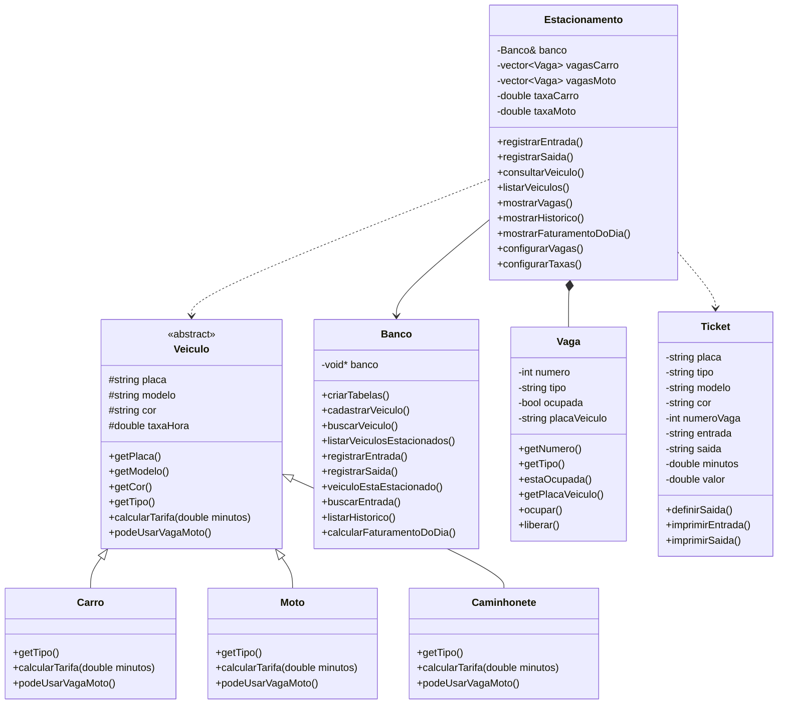
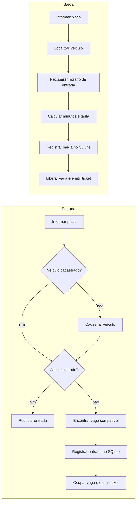
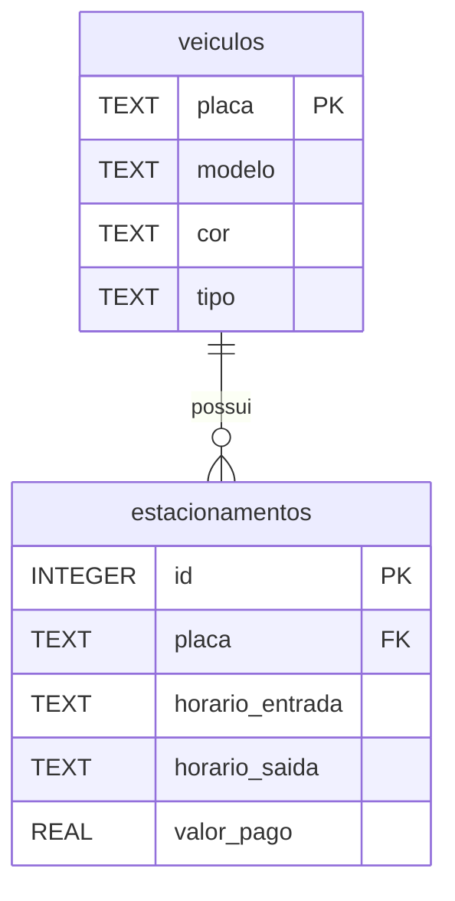

# 🚗 Sistema de Gerenciamento de Estacionamento


Aplicação de terminal em **C++** que controla a entrada e a saída de veículos, a ocupação das vagas, o cálculo de tarifas, a emissão de tickets, o histórico e o faturamento. Os dados são persistidos em **SQLite**.

Projeto desenvolvido para a disciplina **Estruturas de Dados Orientadas a Objetos (CIN0135)**, da **UFPE**, sob orientação do professor **Francisco Paulo**.

---

## Sumário

- [Funcionalidades](#funcionalidades)
- [Como executar](#como-executar)
- [Exemplo de uso](#exemplo-de-uso)
- [Regras de negócio](#regras-de-negócio)
- [Conceitos de POO aplicados](#conceitos-de-poo-aplicados)
- [Arquitetura](#arquitetura)
- [Banco de dados](#banco-de-dados)
- [Estrutura do projeto](#estrutura-do-projeto)
- [Limitações conhecidas](#limitações-conhecidas)
- [Links e documentação](#links-e-documentação)
- [Equipe](#equipe)

---

## Funcionalidades

| Menu | Funcionalidade | Descrição |
| :--: | -------------- | --------- |
| 1 | **Registrar entrada** | Cadastra o veículo (se for novo), valida se já está estacionado, aloca uma vaga compatível e emite o ticket de entrada. |
| 2 | **Registrar saída** | Calcula o tempo de permanência em minutos, o valor devido, libera a vaga e emite o ticket de saída. |
| 3 | **Consultar vagas** | Mostra as vagas disponíveis para carros/caminhonetes e para motos. |
| 4 | **Consultar veículo** | Busca por placa: tipo, modelo, cor, situação atual e horário de entrada. |
| 5 | **Listar veículos** | Exibe quem está no estacionamento agora (vaga, placa, tipo, modelo, cor e entrada). |
| 6 | **Histórico de saídas** | Lista saídas anteriores com placa, entrada, saída e valor pago. |
| 7 | **Faturamento do dia** | Soma o valor arrecadado em uma data. |
| 9 | **Configurações** | Altera a quantidade de vagas e as tarifas em tempo de execução. |
| 0 | **Sair** | Encerra o programa. |

---

## Como executar

### Requisitos

- Compilador com suporte a **C++17**
- **CMake 3.20** ou superior
- **SQLite3** (biblioteca e cabeçalhos de desenvolvimento)

<details>
<summary><b>Linux</b></summary>

```bash
# Dependências (Debian/Ubuntu)
sudo apt install build-essential cmake libsqlite3-dev

# Compilar e executar
cmake -S . -B build
cmake --build build
./build/estacionamento
```

</details>

<details>
<summary><b>Windows (MSYS2 / MinGW)</b></summary>

```powershell
cmake -S . -B build -G "MinGW Makefiles" -DCMAKE_PREFIX_PATH="C:/msys64/ucrt64"
cmake --build build
.\build\estacionamento.exe
```

</details>

> **Banco de dados:** ao iniciar, o programa abre (ou cria) o arquivo `estacionamento.db` no diretório de execução. As tabelas são criadas automaticamente na primeira execução.

---

## Exemplo de uso

Menu principal:

```text
==============================
       ESTACIONAMENTO
==============================
1 - Registrar entrada
2 - Registrar saída
3 - Consultar vagas
4 - Consultar veículo
5 - Listar veículos no estacionamento
6 - Histórico de saídas
7 - Faturamento do dia
9 - Configurações
0 - Sair
```

Menu de configurações:

```text
==============================
        CONFIGURAÇÕES
==============================
1 - Alterar quantidade de vagas
2 - Alterar tarifas
0 - Voltar
```

---

## Regras de negócio

**Veículos.** Existem três tipos (`Carro`, `Moto` e `Caminhonete`). Todo veículo possui placa, modelo e cor. A **placa** identifica o veículo; se ele retornar ao estacionamento, o cadastro existente é reaproveitado.

**Vagas e compatibilidade.**

| Veículo | Vaga utilizada |
| ------- | -------------- |
| Moto | Vaga de moto (exclusiva para motos) |
| Carro | Vaga de carro |
| Caminhonete | Vaga de carro |

**Tarifas.** Carros e caminhonetes compartilham a mesma tarifa; motos têm tarifa própria. Ambas podem ser alteradas no menu de configurações.

**Cobrança.** O tempo de permanência é calculado em **minutos**, e a cobrança é proporcional a esse tempo.

**Tickets.** A classe `Ticket` gera os comprovantes exibidos no terminal:

| Campo | Entrada | Saída |
| ----- | :-----: | :---: |
| Placa, tipo, modelo e cor | ✅ | ✅ |
| Número da vaga | ✅ | ✅ |
| Horário de entrada | ✅ | ✅ |
| Horário de saída | | ✅ |
| Tempo de permanência | | ✅ |
| Valor pago | | ✅ |

---

## Conceitos de POO aplicados

| Conceito | Onde aparece |
| -------- | ------------ |
| **Abstração** | `Veiculo` é uma classe abstrata que define o contrato comum a todos os veículos. |
| **Herança** | `Carro`, `Moto` e `Caminhonete` herdam de `Veiculo`. |
| **Polimorfismo** | Métodos virtuais puros, como `calcularTarifa`, são implementados de forma diferente por cada classe derivada. |
| **Encapsulamento** | Atributos com acesso controlado (`private`/`protected`) e manipulados por métodos públicos. |

```cpp
// Veiculo.h: cada tipo de veículo define sua própria regra de cobrança
virtual double calcularTarifa(double minutos) const = 0;
```

---

## Arquitetura

### Responsabilidade das classes

| Classe | Responsabilidade |
| ------ | ---------------- |
| `Veiculo` | Classe abstrata base dos veículos |
| `Carro`, `Moto`, `Caminhonete` | Tipos concretos de veículo |
| `Vaga` | Representa e controla o estado de uma vaga |
| `Estacionamento` | Orquestra o funcionamento geral (entrada, saída, consultas, configurações) |
| `Ticket` | Armazena e exibe os dados dos tickets |
| `Banco` | Concentra todo o acesso ao SQLite |

`main.cpp` contém o menu principal e a interação com o usuário.

### Diagrama de classes



### Fluxos principais



---

## Banco de dados

Toda a comunicação com o SQLite passa pela classe `Banco`.



Cada entrada gera um registro em `estacionamentos`; na saída, esse mesmo registro recebe `horario_saida` e `valor_pago`.

### Operações de CRUD

| Operação | Aplicação no sistema |
| -------- | -------------------- |
| **Create** | Cadastro de veículos e registro de entradas |
| **Read** | Consulta de veículos, vagas, veículos estacionados, histórico e faturamento |
| **Update** | Registro de saída (atualiza o registro de permanência) e configurações |
| **Delete** | Não implementado nesta versão |

---

## Estrutura do projeto

```text
estacionamento/
├── CMakeLists.txt
├── README.md
├── include/
│   ├── Banco.h
│   ├── Caminhonete.h
│   ├── Carro.h
│   ├── Estacionamento.h
│   ├── Moto.h
│   ├── Ticket.h
│   ├── Vaga.h
│   └── Veiculo.h
└── src/
    ├── Banco.cpp
    ├── Caminhonete.cpp
    ├── Carro.cpp
    ├── Estacionamento.cpp
    ├── Moto.cpp
    ├── Ticket.cpp
    ├── Vaga.cpp
    ├── Veiculo.cpp
    └── main.cpp
```

Os arquivos `.h` (em `include/`) declaram as classes; os `.cpp` (em `src/`) implementam seus métodos.

---

## Limitações conhecidas

- Interface apenas em terminal (sem GUI).
- A placa é digitada manualmente (não há leitura automática).
- Não há exclusão de veículos no banco de dados.

---

## Links e documentação

| Item | Link |
| ---- | ---- |
| 📦 Repositório | https://github.com/MrTicos/Sistema-de-Gerenciamento-de-um-estacionamento- |
| 🌐 Página do projeto | _em breve_ |
| 📄 Relatório | _em breve_ |
| 🎥 Vídeo de apresentação | _em breve_ |

---

## Equipe

| Integrante | GitHub |
| ---------- | ------ |
| Thiago Silva | [@MrTicos](https://github.com/MrTicos) |
| Gabriel Freitas | [@Gfal0](https://github.com/Gfal0) |
| Miguel Nascimento | — |
