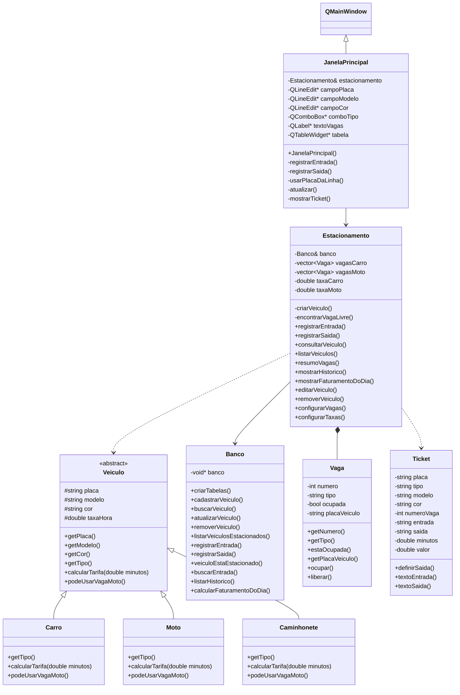
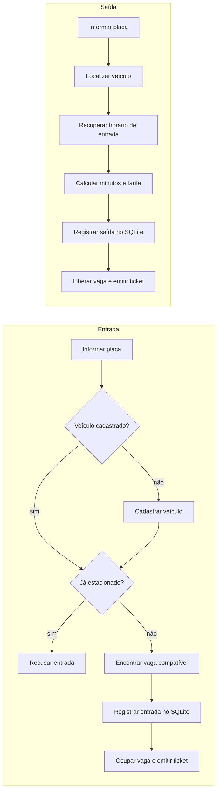
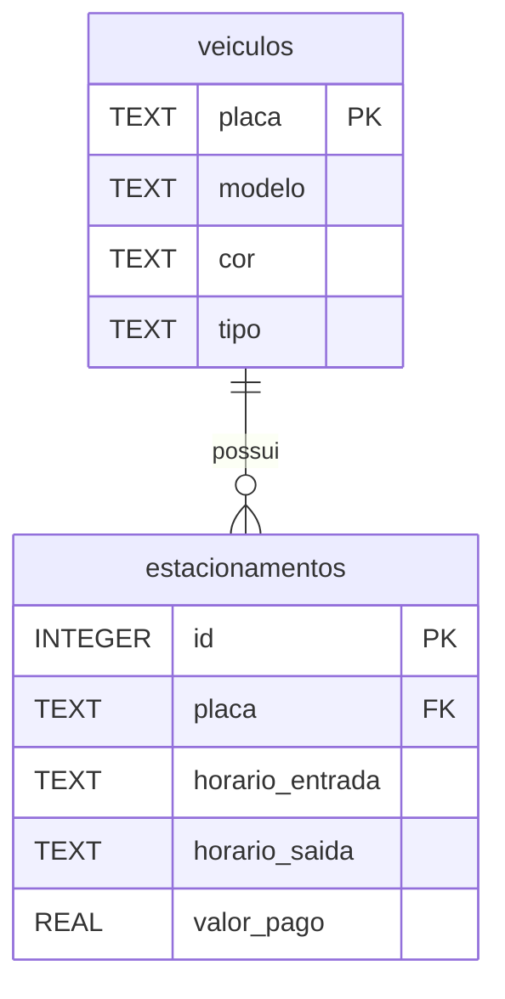

# 🚗 Sistema de Gerenciamento de Estacionamento


Aplicação em **C++** que controla a entrada e a saída de veículos, a ocupação das vagas, o cálculo de tarifas, a emissão de tickets, o histórico e o faturamento. Os dados são persistidos em **SQLite** e a interface gráfica é feita com **Qt 6 (Widgets)**. O projeto gera dois executáveis: `estacionamento` (terminal) e `estacionamento_gui` (interface gráfica).

Projeto desenvolvido para a disciplina **Estruturas de Dados Orientadas a Objetos (CIN0135)**, da **UFPE**, sob orientação do professor **Francisco Paulo**.

<p align="center">
  
</p>


---

## Sumário

- [Interface gráfica](#interface-gráfica)
- [Funcionalidades](#funcionalidades)
- [Como executar](#como-executar)
- [Regras de negócio](#regras-de-negócio)
- [Conceitos de POO aplicados](#conceitos-de-poo-aplicados)
- [Arquitetura](#arquitetura)
- [Banco de dados](#banco-de-dados)
- [Estrutura do projeto](#estrutura-do-projeto)
- [Limitações conhecidas](#limitações-conhecidas)
- [Links e documentação](#links-e-documentação)
- [Equipe](#equipe)

---

## Interface gráfica

A interface é uma janela única (`JanelaPrincipal`, baseada em `QMainWindow`), dividida em duas áreas:

**Formulário "Veículo" (à esquerda)**

- Campos de **placa**, **modelo**, **cor** e **tipo** (Carro, Moto ou Caminhonete).
- Botões **Registrar entrada** e **Registrar saída**.
- Para um veículo que já foi cadastrado, basta digitar a placa: modelo, cor e tipo são reaproveitados.
- A placa é normalizada automaticamente (sem espaços nas pontas e em maiúsculas).

**Painel de ocupação (à direita)**

- No topo, as **vagas livres** de carro/caminhonete e de moto (por exemplo, "7 de 20").
- Uma tabela com os **veículos estacionados**: vaga, placa, tipo, modelo, cor e horário de entrada.
- Ao clicar em uma linha da tabela, a placa é copiada para o formulário, o que facilita registrar a saída.

**Tickets e erros**

- Depois de uma entrada ou saída bem-sucedida, o ticket é exibido em uma caixa de diálogo com fonte monoespaçada.
- Quando a operação não é possível (por exemplo, veículo já estacionado ou sem vaga livre), a mensagem aparece em um aviso.

<p align="center">
  
  &nbsp;&nbsp;&nbsp;
  
</p>

A janela não contém regras de negócio: ela apenas chama os métodos de `Estacionamento`, recebe um `Resultado` (sucesso e mensagem) e atualiza a tela.

---

## Funcionalidades

### Funcionalidades do sistema

| Funcionalidade | Descrição |
| -------------- | --------- |
| **Registrar entrada** | Cadastra o veículo (se for novo), valida se já está estacionado, aloca uma vaga compatível e emite o ticket de entrada. |
| **Registrar saída** | Calcula o tempo de permanência em minutos, o valor devido, libera a vaga e emite o ticket de saída. |
| **Consultar vagas** | Mostra as vagas livres para carros/caminhonetes e para motos. |
| **Consultar veículo** | Busca por placa: tipo, modelo, cor, situação atual e horário de entrada. |
| **Listar veículos** | Exibe quem está no estacionamento agora (vaga, placa, tipo, modelo, cor e entrada). |
| **Histórico de saídas** | Lista saídas anteriores com placa, entrada, saída e valor pago. |
| **Faturamento do dia** | Soma o valor arrecadado em uma data. |
| **Gerenciar veículos** | Edita modelo e cor de um veículo cadastrado ou remove o cadastro (somente se ele não estiver estacionado). |
| **Configurações** | Altera a quantidade de vagas e as tarifas em tempo de execução. |

### Menu do terminal

| Menu | Funcionalidade |
| :--: | -------------- |
| 1 | Registrar entrada |
| 2 | Registrar saída |
| 3 | Consultar vagas |
| 4 | Consultar veículo |
| 5 | Listar veículos no estacionamento |
| 6 | Histórico de saídas |
| 7 | Faturamento do dia |
| 8 | Gerenciar veículos |
| 9 | Configurações |
| 0 | Sair |

---

## Como executar

### Requisitos

- Compilador com suporte a **C++17**
- **CMake 3.20** ou superior
- **SQLite3** (biblioteca e cabeçalhos de desenvolvimento)
- **Qt 6 (módulo Widgets)**, necessário apenas para a interface gráfica. Se o CMake não encontrar o Qt 6, ele compila somente a versão de terminal e avisa: `Qt6 nao encontrado: compilando apenas a versao de terminal.`

<details>
<summary><b>Linux</b></summary>

```bash
# Dependências (Debian/Ubuntu)
sudo apt install build-essential cmake libsqlite3-dev qt6-base-dev

# Compilar
cmake -S . -B build
cmake --build build

# Executar
./build/estacionamento        # terminal
./build/estacionamento_gui    # interface gráfica
```

</details>

<details>
<summary><b>Windows (MSYS2 / MinGW)</b></summary>

```powershell
# Dependência da interface gráfica (terminal do MSYS2 UCRT64)
pacman -S mingw-w64-ucrt-x86_64-qt6-base

# Compilar
cmake -S . -B build -G "MinGW Makefiles" -DCMAKE_PREFIX_PATH="C:/msys64/ucrt64"
cmake --build build

# Executar
.\build\estacionamento.exe        # terminal
.\build\estacionamento_gui.exe    # interface gráfica
```

Se a janela não abrir por falta de DLLs do Qt, execute pelo terminal do MSYS2 UCRT64 ou acrescente `C:\msys64\ucrt64\bin` ao `PATH`.

</details>

### Banco de dados

Ao iniciar, o programa abre (ou cria) o arquivo `estacionamento.db` no diretório de execução, e as tabelas são criadas automaticamente na primeira vez.

Na interface gráfica, é possível usar outro arquivo definindo a variável de ambiente `ESTACIONAMENTO_DB`, o que é útil para testes e demonstrações sem mexer nos dados reais:

```powershell
# Windows (PowerShell)
$env:ESTACIONAMENTO_DB = "demo.db"
```

```bash
# Linux
ESTACIONAMENTO_DB=demo.db ./build/estacionamento_gui
```

---

## Regras de negócio

**Veículos.** Existem três tipos (`Carro`, `Moto` e `Caminhonete`). Todo veículo possui placa, modelo e cor. A **placa** identifica o veículo; se ele retornar ao estacionamento, o cadastro existente é reaproveitado.

**Vagas e compatibilidade.**

| Veículo | Vaga utilizada |
| ------- | -------------- |
| Moto | Vaga de moto (exclusiva para motos) |
| Carro | Vaga de carro |
| Caminhonete | Vaga de carro |

O estacionamento inicia com 20 vagas de carro e 10 de moto. Esses números podem ser alterados nas configurações.

**Tarifas.** Carros e caminhonetes compartilham a mesma tarifa; motos têm tarifa própria. Ambas podem ser alteradas nas configurações.

**Cobrança.** O tempo de permanência é calculado em **minutos**, e a cobrança é proporcional a esse tempo.

**Gerenciamento de veículos.** É possível editar o modelo e a cor de um veículo cadastrado. A remoção do cadastro só é permitida se o veículo não estiver estacionado, e o histórico de estadias é mantido.

**Tickets.** A classe `Ticket` gera os comprovantes de entrada e de saída:

| Campo | Entrada | Saída |
| ----- | :-----: | :---: |
| Placa, tipo, modelo e cor | ✅ | ✅ |
| Número da vaga | ✅ | ✅ |
| Horário de entrada | ✅ | ✅ |
| Horário de saída | | ✅ |
| Tempo de permanência | | ✅ |
| Valor pago | | ✅ |

---

## Conceitos de POO aplicados

| Conceito | Onde aparece |
| -------- | ------------ |
| **Abstração** | `Veiculo` é uma classe abstrata que define o contrato comum a todos os veículos. |
| **Herança** | `Carro`, `Moto` e `Caminhonete` herdam de `Veiculo`; `JanelaPrincipal` herda de `QMainWindow`. |
| **Polimorfismo** | Métodos virtuais puros, como `calcularTarifa`, são implementados de forma diferente por cada classe derivada. Em `Estacionamento::registrarSaida`, a chamada é feita por um `unique_ptr<Veiculo>`. |
| **Encapsulamento** | Atributos com acesso controlado (`private`/`protected`) e manipulados por métodos públicos. |
| **Fábrica simples** | `Estacionamento::criarVeiculo` decide qual classe concreta instanciar e devolve sempre um `Veiculo`. |
| **Separação de responsabilidades** | A interface (`JanelaPrincipal`) só exibe e coleta dados; as regras ficam em `Estacionamento` e o acesso ao SQLite, em `Banco`. |

```cpp
// Veiculo.h: cada tipo de veículo define sua própria regra de cobrança
virtual double calcularTarifa(double minutos) const = 0;

// Estacionamento.cpp: a versão executada depende do objeto real
unique_ptr<Veiculo> veiculo = criarVeiculo(dados);
double valor = veiculo->calcularTarifa(minutos);
```

---

## Arquitetura

### Responsabilidade das classes

| Classe | Responsabilidade |
| ------ | ---------------- |
| `Veiculo` | Classe abstrata base dos veículos |
| `Carro`, `Moto`, `Caminhonete` | Tipos concretos de veículo |
| `Vaga` | Representa e controla o estado de uma vaga |
| `Estacionamento` | Orquestra o funcionamento geral (entrada, saída, consultas, gerenciamento e configurações) |
| `Ticket` | Armazena os dados dos tickets e gera o texto de entrada e de saída |
| `Banco` | Concentra todo o acesso ao SQLite |
| `JanelaPrincipal` | Janela Qt: formulário, botões, vagas livres e tabela de veículos estacionados |

### Diagrama de classes



### Fluxos principais



---

## Banco de dados

Toda a comunicação com o SQLite passa pela classe `Banco`.



Cada entrada gera um registro em `estacionamentos`; na saída, esse mesmo registro recebe `horario_saida` e `valor_pago`.

### Operações de CRUD

| Operação | Aplicação no sistema |
| -------- | -------------------- |
| **Create** | Cadastro de veículos e registro de entradas |
| **Read** | Consulta de veículos, vagas, veículos estacionados, histórico e faturamento |
| **Update** | Edição de modelo e cor do veículo; registro de saída (atualiza o registro de permanência) |
| **Delete** | Remoção do cadastro de um veículo que não esteja estacionado (o histórico é preservado) |

---

## Estrutura do projeto

```text
estacionamento/
├── CMakeLists.txt
├── README.md
├── docs/
│   ├── index.html
│   └── RELATORIO.md
├── include/
│   ├── Banco.h
│   ├── Caminhonete.h
│   ├── Carro.h
│   ├── Estacionamento.h
│   ├── Moto.h
│   ├── Ticket.h
│   ├── Vaga.h
│   └── Veiculo.h
├── gui/
│   ├── JanelaPrincipal.cpp
│   ├── JanelaPrincipal.h
│   └── main_gui.cpp
└── src/
    ├── Banco.cpp
    ├── Caminhonete.cpp
    ├── Carro.cpp
    ├── Estacionamento.cpp
    ├── Moto.cpp
    ├── Ticket.cpp
    ├── Vaga.cpp
    ├── Veiculo.cpp
    └── main.cpp
```

Os arquivos `.h` (em `include/`) declaram as classes do núcleo e os `.cpp` (em `src/`) as implementam. O núcleo é compilado como a biblioteca estática `nucleo`, usada pelos dois executáveis: o terminal (`src/main.cpp`) e a interface gráfica (pasta `gui/`). A pasta `docs/` contém o relatório e a página do projeto.

---

## Limitações conhecidas

- A placa é digitada manualmente (não há leitura automática).
- O número da vaga não é guardado no banco: ao reabrir o programa, cada veículo estacionado recebe a primeira vaga livre do seu tipo.
- A janela principal cobre entrada, saída, vagas livres e veículos estacionados; histórico, faturamento, gerenciamento de veículos e configurações estão disponíveis no menu do terminal.

---

## Links e documentação

| Item | Link |
| ---- | ---- |
| 📦 Repositório | https://github.com/MrTicos/Sistema-de-Gerenciamento-de-um-estacionamento- |
| 🌐 Página do projeto | https://mrticos.github.io/Sistema-de-Gerenciamento-de-um-estacionamento-/ |
| 📄 Relatório | https://github.com/MrTicos/Sistema-de-Gerenciamento-de-um-estacionamento-/blob/main/docs/RELATORIO.md |

---

## Equipe

| Integrante | GitHub |
| ---------- | ------ |
| Thiago Silva | [@MrTicos](https://github.com/MrTicos) |
| Gabriel Freitas | [@Gfal0](https://github.com/Gfal0) |
| Miguel Nascimento | — |
