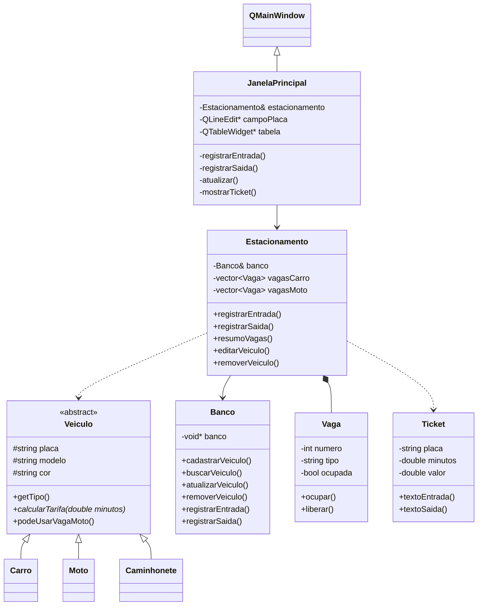
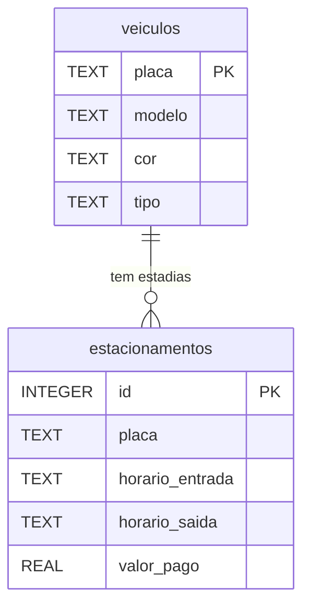

# Relatório do Sistema de Gerenciamento de Estacionamento

- **Disciplina:** Estruturas de Dados Orientadas a Objetos (CIN0135) · **Instituição:** UFPE
- **Professor:** Francisco Paulo Magalhães Simões
- **Equipe:** Thiago Silva, Gabriel Freitas, Miguel Nascimento
- **Repositório:** https://github.com/MrTicos/Sistema-de-Gerenciamento-de-um-estacionamento-

---

## 1. Introdução

Este relatório descreve o sistema de gerenciamento de estacionamento desenvolvido em **C++17** com **Programação Orientada a Objetos (POO)**, persistência em **SQLite** e interface gráfica em **Qt (Widgets)**. O trabalho atende à opção 1 do projeto prático da disciplina: construir um sistema de informação com conceitos de POO, com diagrama de classes, código e CRUD conectado a um banco de dados.

## 2. Descrição do problema

Um estacionamento precisa saber quais vagas estão livres, quem entrou e quando, quanto cada veículo deve pagar ao sair e quanto foi arrecadado. Feito manualmente, esse controle gera erros de cobrança e perda de histórico. O sistema automatiza esse fluxo em uma aplicação operada por um atendente, com interface gráfica e menu de terminal.

### Escopo

- A **placa é digitada manualmente** (não há câmera nem reconhecimento automático).
- Os **horários de entrada e saída são registrados automaticamente** pelo sistema.
- Existem dois tipos de vaga (carro e moto) e três tipos de veículo (carro, moto e caminhonete, no sentido de picape/utilitário, não caminhão pesado).
- A tarifa depende do tipo de veículo e do tempo, em minutos: moto tem 15 minutos de tolerância gratuita e caminhonete paga 20% a mais.

## 3. Requisitos

### 3.1 Requisitos funcionais

| Código | Requisito |
| ------ | --------- |
| RF01 | Registrar a entrada de um veículo, cadastrando-o se for novo e alocando uma vaga compatível. |
| RF02 | Registrar a saída, calculando o tempo de permanência e o valor a pagar, e liberando a vaga. |
| RF03 | Emitir ticket de entrada e ticket de saída. |
| RF04 | Consultar a disponibilidade de vagas por tipo. |
| RF05 | Consultar um veículo pela placa. |
| RF06 | Listar os veículos atualmente estacionados. |
| RF07 | Consultar o histórico de saídas. |
| RF08 | Consultar o faturamento de uma data. |
| RF09 | Alterar a quantidade de vagas e as tarifas durante a execução. |
| RF10 | Editar os dados (modelo e cor) de um veículo cadastrado. |
| RF11 | Remover o cadastro de um veículo que não esteja estacionado. |
| RF12 | Oferecer uma interface gráfica em uma única janela para registrar entrada e saída, ver as vagas livres e listar os veículos estacionados. |

### 3.2 Requisitos não funcionais

- Linguagem **C++17**, com código comentado e organizado em classes.
- Persistência em **SQLite** (arquivo `estacionamento.db`, criado automaticamente).
- Compilação com **CMake 3.20+**, em Windows e Linux.
- Interface gráfica em **Qt 6 (Widgets)** e interface de terminal por menus.
- Separação entre a interface e as regras de negócio: a interface apenas chama `Estacionamento` e exibe o resultado.

### 3.3 Regras de negócio

| Regra | Descrição |
| ----- | --------- |
| RN01 | A placa identifica unicamente o veículo. |
| RN02 | Moto ocupa vaga de moto; carro e caminhonete ocupam vaga de carro. |
| RN03 | Vaga de moto é exclusiva para motos. |
| RN04 | Carro e caminhonete usam a taxa por hora de carro; moto tem taxa própria. Moto não paga até 15 minutos; caminhonete paga 20% a mais. |
| RN05 | Um veículo já estacionado não pode registrar nova entrada. |
| RN06 | Um veículo estacionado não pode ter o cadastro removido. |
| RN07 | O histórico de estadias é preservado mesmo que o cadastro do veículo seja removido. |

## 4. Modelagem

### 4.1 Classes

| Classe | Responsabilidade |
| ------ | ---------------- |
| `Veiculo` | Classe abstrata base; guarda placa, modelo e cor e declara `calcularTarifa`. |
| `Carro`, `Moto`, `Caminhonete` | Especializações de `Veiculo`, cada uma com sua regra de tarifa e de vaga. |
| `Vaga` | Representa uma vaga (número, tipo, ocupação, placa do ocupante). |
| `Estacionamento` | Coordena as operações do sistema e mantém as vagas e tarifas. |
| `Ticket` | Reúne os dados dos comprovantes e gera o texto de entrada e de saída. |
| `Banco` | Única classe que acessa o SQLite; implementa o CRUD. |
| `JanelaPrincipal` | Janela Qt (`QMainWindow`) com formulário, botões, vagas livres e tabela de veículos estacionados. |

### 4.2 Diagrama de classes



### 4.3 Banco de dados



Cada entrada cria um registro em `estacionamentos`. Na saída, o mesmo registro recebe `horario_saida` e `valor_pago`.

### 4.4 CRUD

| Operação | Funcionalidade | Tabela |
| -------- | -------------- | ------ |
| **Create** | Cadastro de veículo; registro de entrada | `veiculos`, `estacionamentos` |
| **Read** | Consulta de veículo, vagas, estacionados, histórico e faturamento | `veiculos`, `estacionamentos` |
| **Update** | Edição de modelo e cor; registro de saída | `veiculos`, `estacionamentos` |
| **Delete** | Remoção do cadastro de veículo não estacionado | `veiculos` |

### 4.5 Interface gráfica

A interface é uma janela única, `JanelaPrincipal`, construída com **Qt 6 Widgets** (pasta `gui/`, executável `estacionamento_gui`).


*Figura 1 – Janela principal: formulário do veículo à esquerda; vagas livres e tabela de veículos estacionados à direita.*

| Área | Conteúdo |
| ---- | -------- |
| Formulário "Veículo" | Campos de placa, modelo, cor e tipo (Carro, Moto ou Caminhonete) e os botões **Registrar entrada** e **Registrar saída**. |
| Vagas livres | Texto no topo com as vagas livres e o total, para carros/caminhonetes e para motos. |
| Tabela | Veículos estacionados, com vaga, placa, tipo, modelo, cor e horário de entrada. |

Comportamento:

- Se a placa já está cadastrada, basta digitá-la: modelo, cor e tipo são reaproveitados.
- A placa é normalizada (sem espaços nas pontas e em maiúsculas) antes de ser enviada ao sistema.
- Ao clicar em uma linha da tabela, a placa é copiada para o formulário, o que facilita registrar a saída.
- O ticket de entrada ou de saída é mostrado em uma caixa de diálogo com fonte monoespaçada.
- Quando a operação não é possível (veículo já estacionado, sem vaga livre, placa inexistente), a mensagem aparece em um aviso.

 &nbsp; 

*Figuras 2 e 3 – Tickets de entrada e de saída exibidos em caixa de diálogo.*

A janela não implementa regras de negócio. Ela chama `Estacionamento::registrarEntrada` e `Estacionamento::registrarSaida`, recebe um `Resultado` (sucesso e mensagem) e atualiza a tela. Assim, a mesma lógica serve a interface gráfica e ao terminal, e as regras podem ser testadas sem a janela.

O arquivo do banco pode ser trocado com a variável de ambiente `ESTACIONAMENTO_DB`, o que é útil para testes e demonstrações.

## 5. Conceitos de POO utilizados

| Conceito | Como foi aplicado |
| -------- | ----------------- |
| **Classes e objetos** | Cada entidade do domínio (veículo, vaga, ticket, estacionamento) é uma classe; o sistema cria objetos em tempo de execução. |
| **Abstração** | `Veiculo` é abstrata: define o que todo veículo faz, sem fixar como a tarifa é calculada. |
| **Herança** | `Carro`, `Moto` e `Caminhonete` herdam atributos e métodos de `Veiculo`; `JanelaPrincipal` herda de `QMainWindow`. |
| **Polimorfismo** | `calcularTarifa` é virtual pura em `Veiculo` e implementada em cada classe derivada. O chamador usa o tipo base e o comportamento é decidido pelo objeto concreto em tempo de execução. |
| **Encapsulamento** | Atributos `private` ou `protected`, acessados por métodos públicos (`get...`, `ocupar`, `liberar`). |
| **Modificadores de acesso** | `public` para a interface das classes, `protected` para o que as derivadas reaproveitam (como `placa` em `Veiculo`) e `private` para o estado interno (como `ocupada` em `Vaga`). |
| **Referências e ponteiros** | `Estacionamento` guarda uma referência (`Banco&`) para usar a mesma conexão do banco sem copiá-la; `Banco` guarda o ponteiro para o handle do SQLite; `encontrarVagaLivre` devolve um ponteiro (`Vaga*`) para a vaga original, que é ocupada sem cópia (ou `nullptr` quando não há vaga); `criarVeiculo` devolve um ponteiro inteligente (`unique_ptr<Veiculo>`), que libera o objeto automaticamente; as listagens percorrem as vagas por referência constante (`const Vaga&`). |

### Exemplo de polimorfismo no código

Em `Estacionamento::registrarSaida` (`src/Estacionamento.cpp`), o veículo é manipulado por um ponteiro para a **classe base**:

```cpp
unique_ptr<Veiculo> veiculo = criarVeiculo(dados);
double valor = veiculo->calcularTarifa(minutos);
```

A variável `veiculo` tem o tipo `Veiculo`, mas o objeto apontado é um `Carro`, uma `Moto` ou uma `Caminhonete`, e isso só é conhecido quando o programa executa. Por isso, a chamada a `calcularTarifa` executa a versão da classe derivada correta, sem nenhum `if` sobre o tipo do veículo no ponto do cálculo.

### Criação dos objetos (fábrica simples)

O método `Estacionamento::criarVeiculo` decide qual classe concreta instanciar a partir do tipo guardado no banco e devolve sempre um `unique_ptr<Veiculo>`:

```cpp
unique_ptr<Veiculo> Estacionamento::criarVeiculo(const DadosVeiculo& dados) {
    if (dados.tipo == "Moto") {
        return make_unique<Moto>(dados.placa, dados.modelo, dados.cor, taxaMoto);
    }
    if (dados.tipo == "Caminhonete") {
        return make_unique<Caminhonete>(dados.placa, dados.modelo, dados.cor, taxaCarro);
    }
    return make_unique<Carro>(dados.placa, dados.modelo, dados.cor, taxaCarro);
}
```

Esse método concentra a criação dos objetos em um só lugar e esconde das demais funções qual classe concreta foi criada. Ele segue a ideia do padrão **Factory** na sua forma simples (*Simple Factory*): o resto do código só conhece `Veiculo`.

## 6. Tecnologias

C++17, SQLite 3, Qt 6 (Widgets), CMake 3.20+, Git e GitHub.

## 7. Como executar

É necessário ter instalados um compilador C++17, o CMake 3.20+, o SQLite3 e o **Qt 6 (módulo Widgets)**, este último usado apenas pela interface gráfica. Sem o Qt 6, o CMake compila somente a versão de terminal.

O núcleo do sistema (classes de domínio e acesso ao banco) é compilado como a biblioteca estática `nucleo`, usada por dois executáveis: `estacionamento` (terminal) e `estacionamento_gui` (interface gráfica, código na pasta `gui/`).

**Linux**

```bash
sudo apt install build-essential cmake libsqlite3-dev qt6-base-dev
cmake -S . -B build
cmake --build build
./build/estacionamento        # terminal
./build/estacionamento_gui    # interface gráfica
```

**Windows (MSYS2/MinGW)**

```powershell
pacman -S mingw-w64-ucrt-x86_64-qt6-base
cmake -S . -B build -G "MinGW Makefiles" -DCMAKE_PREFIX_PATH="C:/msys64/ucrt64"
cmake --build build
.\build\estacionamento.exe        # terminal
.\build\estacionamento_gui.exe    # interface gráfica
```

## 8. Limitações e trabalhos futuros

- A janela principal cobre entrada, saída, vagas livres e veículos estacionados; histórico, faturamento, gerenciamento de veículos e configurações estão disponíveis no menu do terminal.
- O número da vaga não é guardado no banco: ao reabrir o programa, cada veículo estacionado recebe a primeira vaga livre do seu tipo.
- Levar as demais funções (histórico, faturamento, gerenciamento e configurações) para a interface gráfica.
- Leitura automática de placa não implementada.
- Evoluir a fábrica simples (`criarVeiculo`) para um Factory Method completo, com uma classe de fábrica própria, e aplicar outros padrões (como Singleton para a conexão com o banco).

## 9. Conclusão

O sistema cobre o ciclo completo de operação de um estacionamento e aplica abstração, herança, polimorfismo e encapsulamento em uma aplicação com banco de dados e CRUD completo. O projeto também serviu como primeira experiência da equipe com POO em C++, trabalho em grupo com Git e uso de SQLite e Qt.
